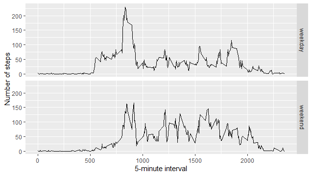

# Reproducible Research::Week 2 Assignment 1


### Loading and preprocessing the data by unzipping the Activity Monitoring Data then reading and loading the CSV file .


```{r loaddata ,echo=TRUE}
unzip(zipfile="activity.zip")
data <- read.csv("C:/Users/hp/Documents/activity.csv")
```


### Calculating the Mean & Median Of the Total Number Of Steps Taken Per Day 


```{r ,echo=TRUE}
library(ggplot2)

total.steps <- tapply(data$steps, data$date, FUN=sum, na.rm=TRUE)
qplot(total.steps, binwidth=1000, xlab="total number of steps taken each day")

 


meanPreNA<- round(mean(total.steps, na.rm=TRUE))

 print(paste("The Mean is :", meanPreNA))
 
```
##  [1] "The Mean is : 9354"
```

medianPreNA <- round (median(total.steps, na.rm=TRUE))

 print(paste("The Median is : " ,medianPreNA))


```
## [1] "The Median is :  10395"

```

## What is the average daily activity pattern?

 # Making a Time series Plot(i.e type="l")of the 5-minute Intervals on the X-Axis ans the Average number of steps taken ,averaged across all days (y-axis)


```{r,echo=TRUE}

library(ggplot2)

averages <- aggregate(x=list(steps=data$steps), by=list(interval=data$interval),
                      FUN=mean, na.rm=TRUE)
ggplot(data=averages, aes(x=interval, y=steps)) +
    geom_line() +
    xlab("5-minute interval") +
    ylab("average number of steps taken")
```


 


On average across all the days in the dataset, the 5-minute interval contains
the maximum number of steps?

```{r ,echo=TRUE}
library(ggplot2)

averages <- aggregate(x=list(steps=data$steps), by=list(interval=data$interval),
                      FUN=mean, na.rm=TRUE)

##"5-Minute Interval containing the most steps on average:"
averages[which.max(averages$steps),]
  
```

```
##     interval steps
## 104      835 206.2
```


## Imputing missing values
There are many days/intervals where there are missing values (coded as `NA`). The presence of missing days may introduce bias into some calculations or summaries of the data.

  ##Calculating and reporting the  strategy for imputing total number of missing values in the dataset (i.e. the total number of rows with NAs)
  

```{r how_many_missing, echo=TRUE}
missing <- is.na(data$steps)

print(paste("The total number of rows with NA is: ",sum(missing)))

```
```
 ## [1] "The total number of rows with NA is:  2304"
```


All of the missing values are filled in with mean value for that 5-minute interval.Creating a new dataset that is equal to the original dataset but with the missing data filled in.

```{r ,echo=TRUE}
# Replace each missing value with the mean value of its 5-minute interval
fill.value <- function(steps, interval) {
    filled <- NA
    if (!is.na(steps))
        filled <- c(steps)
    else
        filled <- (averages[averages$interval==interval, "steps"])
    return(filled)
}
filled.data <- data
filled.data$steps <- mapply(fill.value, filled.data$steps, filled.data$interval)
```

## To Make a Histogram of Total Number OF Steps Taken Each Day

```

Now, using the filled data set, let's make a histogram of the total number of steps taken each day and calculate the mean and median total number of steps.

```{r ,echo=TRUE}
fill.value <- function(steps, interval) {
    filled <- NA
    if (!is.na(steps))
        filled <- c(steps)
    else
        filled <- (averages[averages$interval==interval, "steps"])
    return(filled)
}
filled.data <- data
filled.data$steps <- mapply(fill.value, filled.data$steps, filled.data$interval)

total.steps <- tapply(filled.data$steps, filled.data$date, FUN=sum)
qplot(total.steps, binwidth=1000, xlab="total number of steps taken each day")


 

```
```r
mean(total.steps)
```

```
## [1] 10766.19
```

```r
median(total.steps)
```

```
## [1] 10766.19
```
Mean values and median values are higher after imputing missing data. The reason is that in the original data, there are some days with `steps` values `NA` 
for any `interval`. The total number of steps taken in such days are set to 0s
by default. However, after replacing missing `steps` values with the mean `steps`
of associated `interval` value, these 0 values are removed from the histogram
of total number of steps taken each day.

#Are there differences in activity patterns between weekdays and weekends?

First, let's find the day of the week for each measurement in the dataset. In
this part, we use the dataset with the filled-in values.

  Mean values and median values are higher after imputing missing data. The reason is that in the original data, there are some days with `steps` values `NA` 
for any `interval`. The total number of steps taken in such days are set to 0s
by default.
    However, after replacing missing `steps` values with the mean `steps`
of associated `interval` value, these 0 values are removed from the histogram
of total number of steps taken each day.


```{r ,echo=TRUE}
weekday.or.weekend <- function(date) {
    day <- weekdays(date)
    if (day %in% c("Monday", "Tuesday", "Wednesday", "Thursday", "Friday"))
        return("weekday")
    else if (day %in% c("Saturday", "Sunday"))
        return("weekend")
    else
        stop("invalid date")
}
filled.data$date <- as.Date(filled.data$date)
filled.data$day <- sapply(filled.data$date, FUN=weekday.or.weekend)
```


Now, Creating a  panel plot containing plots of average number of steps taken
on weekdays and weekends.


```{r ,echo=TRUE}
averages <- aggregate(steps ~ interval + day, data=filled.data, mean)
ggplot(averages, aes(interval, steps)) + geom_line() + facet_grid(day ~ .) +
    xlab("5-minute interval") + ylab("Number of steps")
```





##The visualizations shows slight differences in the step patterns throughout the average daily intervals. Weekdays show a large spike in early morning which could coincide with people walking to work/school or transit stations. While step counts on weekends are more consistent throughout the day.
